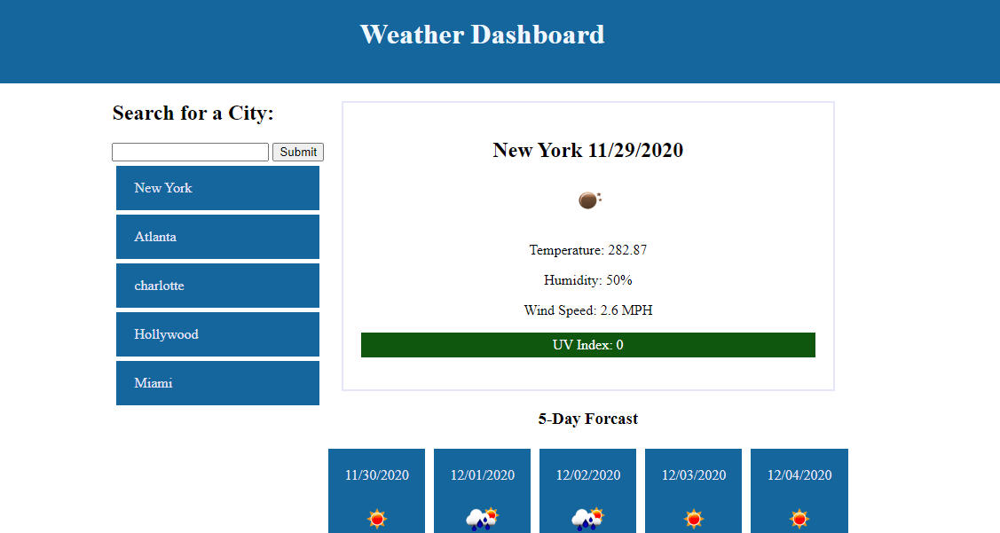

# Weather_Checker

This Weather App uses third-party API's to retrieve weather information about the city requested. When the User enters a city name the Weather App displays the current, city name, date, weather conditions, temprature, humidity, wind speed, UV index, and a 5 day forcast. The weather App also logs recent searches in the local history to create a search history. The search History is displayed on buttons under the search bar. The App also uses the search history to display the latest search when the page first loads.

https://heathw24.github.io/Weather_Checker/

Tools used:

1. JavaScript
2. jQuery
2. AJAX

